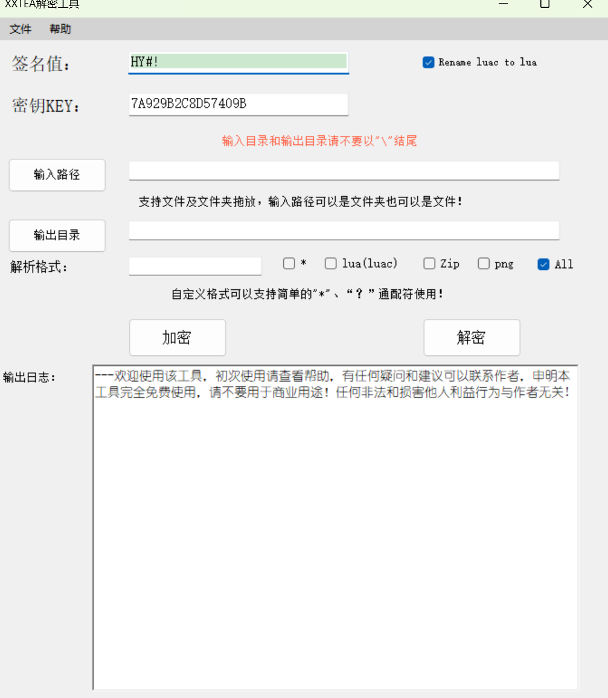

# XXTEA Decryptor

  

A standalone Windows Forms XXTEA encryption and decryption utility for files, folders, Lua assets, and game resource packages.

中文说明：这是一个独立的 XXTEA 加密/解密工具，支持单文件和目录批量处理，适合用于通用 XXTEA 文件解密、资源包解密、Lua/luac 资源分析、游戏资源解包前的数据还原等场景。

This repository was extracted from the `XXTEADecrpty` project in `XXTEA_Decoder` so the generic XXTEA decoder can be maintained and shared independently.

## Keywords

`xxtea`, `xxtea decrypt`, `xxtea decryptor`, `xxtea decoder`, `xxtea encrypt`, `xxtea encryption`, `xxtea decryption`, `windows forms`, `csharp`, `dotnet framework`, `file decryptor`, `batch decrypt`, `lua decrypt`, `luac decrypt`, `game asset decrypt`, `resource decryptor`, `XXTEA解密`, `XXTEA加密`, `XXTEA解码器`, `XXTEA解密工具`, `文件解密工具`, `批量解密`, `游戏资源解密`, `Lua资源解密`

## Features

- Encrypt or decrypt a single file.
- Batch process every file under an input directory.
- Configure the XXTEA sign/header and key in the UI.
- Keep the original directory layout when writing decoded output.
- Build as a lightweight Windows desktop application.

## Use Cases

- Generic XXTEA file encryption and decryption.
- Batch decrypting folders that contain game resources or Lua assets.
- Restoring encrypted resources before further unpacking, diffing, or analysis.
- Maintaining a small C#/.NET Framework XXTEA implementation with a GUI.

## 中文功能

- 支持单个文件加密和解密。
- 支持目录批量解密/加密，并保留原始目录结构输出。
- 可在界面中配置 XXTEA 标识、文件头/sign 和 key。
- 适合通用 XXTEA 解密、Lua/luac 资源解密、游戏资源包解密前处理。
- 基于 C# WinForms，项目结构简单，方便二次开发。

## Build

Open `XXTEADecrypt.sln` with Visual Studio and build the `XXTEADecrypt` project.

The project targets .NET Framework 4.5.2 and uses Windows Forms.

### GitHub Actions

The repository includes a GitHub Actions workflow that builds the Release configuration on Windows for every push, pull request, and manual workflow dispatch. Successful runs upload the Release output as a workflow artifact.

## Notes

- Build output, Visual Studio user settings, signing keys, and the local Codex task ledger are ignored by git.
- No license has been added in this extraction. Add one before relying on explicit redistribution terms.
